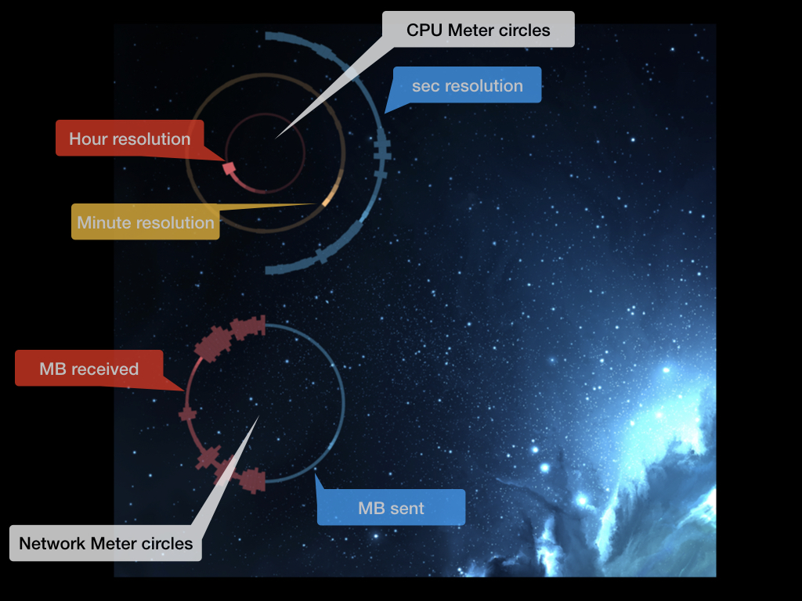

# CSpoons repo

Spoons for the superb [hammerspoon](https://www.hammerspoon.org) project.

## CMeters




Creates circles on desktop (or overlay)
requires **Python 3** to be installed and **psutils**, i.e. after install [Python 3](https://www.python.org/downloads/) do

`
pip3 install psutils
`
 in your Terminal

You can customize the rings in the init.lua under obj.rings.
Please note that drawing too many rings might drain your cpu.

Currently supported are *cpu* and *network* monitors.

You might need to adjust max and min values for network traffic in order to see something.

### Ring example
Rings are part of obj.rings in init.lua, e.g.
```lua
obj.rings = {
    cpu_seconds = { -- name irrelevant as long unique
     radius = 150, -- radius of circle
     startAngle = 0, -- start angle of circle 12 o'clock = 0
     endAngle = 180, -- end angle
     meterType = 'cpu', -- meter type cpu or network
     refreshEvery = 'second', -- refresh cycle
     baseLineAlpha = 0.5, -- alpha value for circle
     stepsToBaseLineAlpha = 5, -- how many steps backwards
     -- starting form current sec/min/hour
     -- will alpha = 1 decrease to reach baseLineAlpha,
     -- in principle creating a fading-out effect over x steps
     minWidth = 3, -- min width of circle
     maxWidth = 70, -- max width of circle
     color = "#3288bd", -- color - thanks colorbrewer :)
     center = { -- center of circle
         x = 200,
         y = 200
     },
     value_range = {
        min = 0, -- which cpu calue will be mapped to minWidth
        max = 100 -- or maxWidth
        -- this is more important for the network ring
     }
    }
}
```

## CMover

Another window mover that supports multiple monitors.
Not fully functional yet.
